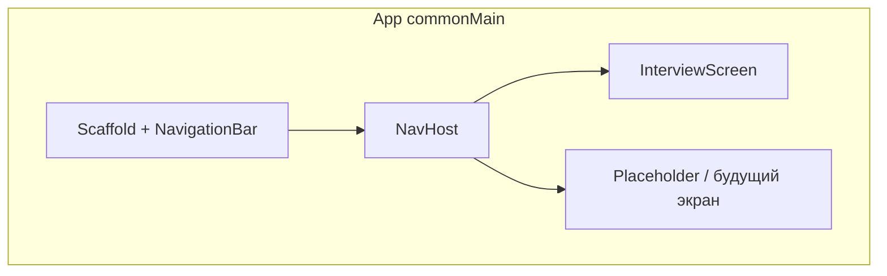

# Нижняя навигация и Compose Navigation (CMP)

## Контекст

- Сейчас `[App.kt](composeApp/src/commonMain/kotlin/ru/towich/achline/App.kt)` внутри `MaterialTheme` / `Surface` сразу показывает `[InterviewScreen](composeApp/src/commonMain/kotlin/ru/towich/achline/presentation/interview/InterviewScreen.kt)`.
- Проект — **Kotlin Multiplatform + Compose Multiplatform** (Android + iOS). Классический артефакт `androidx.navigation:navigation-compose` без форка **не подходит** для `commonMain`.
- Официальная рекомендация Kotlin: зависимость `**org.jetbrains.androidx.navigation:navigation-compose:2.9.2`** в `commonMain` ([документация](https://kotlinlang.org/docs/multiplatform/compose-navigation.html)) — тот же API (`NavController`, `NavHost`, type-safe routes с `@Serializable`), что и Jetpack Navigation в Compose.

## 1. Зависимости

- В `[gradle/libs.versions.toml](gradle/libs.versions.toml)`: добавить версию (например `androidx-navigation = "2.9.2"`) и библиотеку `org.jetbrains.androidx.navigation:navigation-compose`.
- В `[composeApp/build.gradle.kts](composeApp/build.gradle.kts)`: `implementation(libs....)` в `**commonMain.dependencies**` (рядом с остальным Compose).

Плагин `kotlinSerialization` уже подключён — для type-safe маршрутов понадобится `@Serializable` на объектах/классах маршрутов.

## 2. Маршруты верхнего уровня

- Новый файл, например `composeApp/src/commonMain/kotlin/ru/towich/achline/navigation/AppRoutes.kt` (или рядом с `App.kt`): объявить маршруты вкладок, например:
  - `@Serializable data object InterviewRoute` (или `object` — как принято в вашей версии Kotlin для сериализации)
  - `@Serializable data object TopicsRoute` — **простая заглушка** (текст «Скоро» / пустой экран) под будущий каталог из [ТЗ](docs/interview-app-tz.md).

Имена и количество вкладок при необходимости вы поменяете сами; в плане закладываются минимум две, чтобы нижняя панель имела смысл.

## 3. Корневой UI в `App.kt`

- `rememberNavController()`.
- `Scaffold` с `bottomBar`: `NavigationBar` + несколько `NavigationBarItem` (иконки из `material-icons-extended` **не обязательны** — можно начать с `Icons.Default` из набора, который уже тянет material3, либо текст-only на первом шаге; при нехватке иконок — отдельная зависимость `compose.material:material-icons-extended` в CMP).
- В `content` — `NavHost` с `startDestination = InterviewRoute`, внутри DSL `composable<InterviewRoute> { ... }` / `composable<TopicsRoute> { ... }` (API как в доке Kotlin для 2.9.x).

**Переключение вкладок (рекомендуемый паттерн для bottom nav):** при выборе вкладки вызывать `navigate(route) { launchSingleTop = true; restoreState = true; popUpTo(startRoute) { saveState = true } }`, чтобы стеки вкладок не копились и состояние восстанавливалось.

**Выделение выбранного пункта:** через `currentBackStackEntryAsState()` / сравнение текущего destination с маршрутами (стандартный подход из [гайда Android по bottom nav + Compose](https://developer.android.com/jetpack/compose/navigation#bottom-nav), применимый к тому же API).

## 4. Отступы и edge-to-edge

- У `[InterviewScreen](composeApp/src/commonMain/kotlin/ru/towich/achline/presentation/interview/InterviewScreen.kt)` у блока с карточками сейчас есть `.windowInsetsPadding(WindowInsets.navigationBars)` (стр. ~129–130). После появления `Scaffold` с нижней панелью возможно **дублирование** нижнего отступа относительно `innerPadding` у контента. После сборки проверить Android и iOS; при лишнем зазоре — убрать нижний `navigationBars` у контента вкладки и опереться на отступы родителя / `safeDrawing`, не трогая остальную логику экрана.

## 5. Точки входа

- `[MainActivity.kt](composeApp/src/androidMain/kotlin/ru/towich/achline/MainActivity.kt)` и `[MainViewController.kt](composeApp/src/iosMain/kotlin/ru/towich/achline/MainViewController.kt)` менять **не нужно** — по-прежнему вызывают `App()` с уже настроенным `LocalInterviewRepository`.

## Критерий готовности

- На Android и iOS видна нижняя панель с двумя пунктами, переключение между `InterviewScreen` и заглушкой, системная кнопка/жест «назад» ведёт себя предсказуемо для стека навигации.
- Сборка без дублирования конфликтующих артефактов Navigation (только JetBrains `navigation-compose` в `commonMain`).

