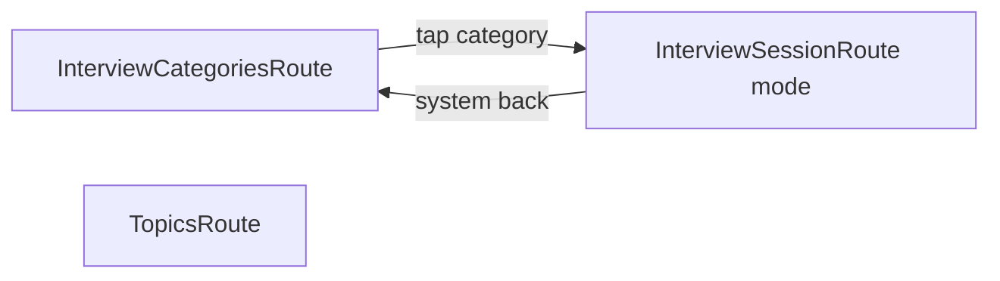

# Стартовый экран категорий и режим «реже отвечал»

## Контекст

- Сейчас `[App.kt](composeApp/src/commonMain/kotlin/ru/towich/achline/App.kt)` стартует сразу на `InterviewRoute`, `[InterviewViewModel](composeApp/src/commonMain/kotlin/ru/towich/achline/presentation/interview/InterviewViewModel.kt)` грузит бандл и вызывает `InterviewSessionEvent.Initialized`.
- Порядок следующей карточки задаётся `[selectNextQuestion` / `pickStackQuestionIds](composeApp/src/commonMain/kotlin/ru/towich/achline/domain/CardSelection.kt)` (алгоритм по ТЗ: сначала тема по сумме `correctCount` / `shownCount`, внутри темы — по прогрессу вопроса).
- В overlay уже есть `[Progress(correctCount, shownCount)](composeApp/src/commonMain/kotlin/ru/towich/achline/domain/Models.kt)`: показ верхней карточки увеличивает `shownCount`, свайп вправо — `correctCount` (`[InterviewSessionReducer](composeApp/src/commonMain/kotlin/ru/towich/achline/domain/interview/InterviewSessionReducer.kt)`).

**Интерпретация формулы:** под «количество ответов» в плане закладываем `**correctCount`** (успешный свайп вправо). Открытие ответа кнопкой сейчас **не пишется** в overlay — если позже понадобится считать «ответ» и это, потребуется отдельное поле в `Progress` и миграция. Для режима «реже отвечал» порядок среди доступных вопросов (вне текущего стека):

1. По возрастанию `correctCount` (меньше успехов — раньше).
2. При равенстве — по убыванию `(shownCount - correctCount)` (больше «разрыв» показов и не-успехов — раньше), как в вашей формуле.
3. Затем стабильный tie-break по `id`.

Так сохраняется согласованность с уже отображаемыми на карточке «Успех» / «Показов».

## Навигация

- В `[AppRoutes.kt](composeApp/src/commonMain/kotlin/ru/towich/achline/navigation/AppRoutes.kt)`:
  - добавить `InterviewCategoriesRoute` (`data object`);
  - заменить текущий `InterviewRoute` на сериализуемый маршрут с режимом, например `@Serializable data class InterviewSessionRoute(val mode: InterviewStackMode)` и `@Serializable enum class InterviewStackMode { AllQuestions, LeastAnswered }` (имена можно слегка подправить под стиль проекта).
- В `[App.kt](composeApp/src/commonMain/kotlin/ru/towich/achline/App.kt)`:
  - `startDestination` → `InterviewCategoriesRoute`;
  - `composable<InterviewCategoriesRoute>` — новый экран;
  - `composable<InterviewSessionRoute>` — извлечь `mode` через `toRoute()`, передать в `InterviewScreen(...)`;
  - нижняя вкладка «Собеседование»: `navigate(InterviewCategoriesRoute)` (как сейчас на корень графа), **selected**, если текущий destination — категории **или** сессия (оба `hasRoute` для соответствующих типов).

## UI стартового экрана

- Новый composable, например `[presentation/interview/InterviewCategoriesScreen.kt](composeApp/src/commonMain/kotlin/ru/towich/achline/presentation/interview/InterviewCategoriesScreen.kt)` (или отдельная папка `presentation/categories/` — по желанию, главное — стиль как у `[InterviewScreen](composeApp/src/commonMain/kotlin/ru/towich/achline/presentation/interview/InterviewScreen.kt)`: градиент/тема).
- Данные: через `LocalInterviewRepository.current` в `LaunchedEffect` загрузить `loadBundleAndOverlay()`, собрать пул как `mergeBundleWithOverlay` (тот же источник, что и у сессии), `**questionCount = merged.size`**.
- Две карточки (Material3 `Card` или кастом в духе приложения):
  - «Все вопросы» — подзаголовок/бейдж с `questionCount`;
  - «Реже отвечал» (или ваша формулировка) — тот же `questionCount` (тот же набор, меняется только порядок).
- `onClick` → `navController.navigate(InterviewSessionRoute(mode))`.

## Домен и сессия

- Ввести тип режима в `domain` (тот же enum, что в навигации, или дублировать маппинг в presentation — предпочтительно один enum в `domain` и его сериализация в `navigation`, чтобы reducer не зависел от Android Navigation).
- Расширить `[InterviewSessionState](composeApp/src/commonMain/kotlin/ru/towich/achline/domain/interview/InterviewSessionState.kt)` полем `stackMode` (или `questionOrder`).
- Расширить `[InterviewSessionEvent.Initialized](composeApp/src/commonMain/kotlin/ru/towich/achline/domain/interview/InterviewSessionEvent.kt)` этим полем; при создании состояния в reducer сохранять его.
- В `[InterviewSessionReducer](composeApp/src/commonMain/kotlin/ru/towich/achline/domain/interview/InterviewSessionReducer.kt)` в `fillStackIds` и при `Initialized` передавать режим в выбор карточек.
- В `[CardSelection.kt](composeApp/src/commonMain/kotlin/ru/towich/achline/domain/CardSelection.kt)`:
  - добавить перегрузку или параметр `mode` с **дефолтом** текущего поведения (`AllQuestions`), чтобы существующие вызовы и `[CardSelectionTest](composeApp/src/commonTest/kotlin/ru/towich/achline/domain/CardSelectionTest.kt)` остались валидны;
  - для `LeastAnswered` реализовать выбор из `selectable` одним `minWithOrNull` с `compareBy` по правилам выше (без агрегации по теме).

## ViewModel

- `[InterviewViewModel](composeApp/src/commonMain/kotlin/ru/towich/achline/presentation/interview/InterviewViewModel.kt)`: принимать режим в конструкторе (фабрика `viewModel { InterviewViewModel(repository, mode) }`), передавать в `Initialized`.
- `[InterviewScreen](composeApp/src/commonMain/kotlin/ru/towich/achline/presentation/interview/InterviewScreen.kt)`: параметр `mode`, прокинуть в `viewModel`.

## Тесты

- Дополнить `[CardSelectionTest](composeApp/src/commonTest/kotlin/ru/towich/achline/domain/CardSelectionTest.kt)` 1–2 кейсами для режима `LeastAnswered` (явные `Progress`, проверка порядка и `excludedIds`).

## Итог по файлам

| Зона         | Файлы                                                                                                    |
| ------------ | -------------------------------------------------------------------------------------------------------- |
| Навигация    | `AppRoutes.kt`, `App.kt`                                                                                 |
| UI           | новый экран категорий; правка `InterviewScreen.kt`                                                       |
| Домен        | `CardSelection.kt`, `InterviewSessionState.kt`, `InterviewSessionEvent.kt`, `InterviewSessionReducer.kt` |
| Presentation | `InterviewViewModel.kt`                                                                                  |
| Тесты        | `CardSelectionTest.kt`                                                                                   |

