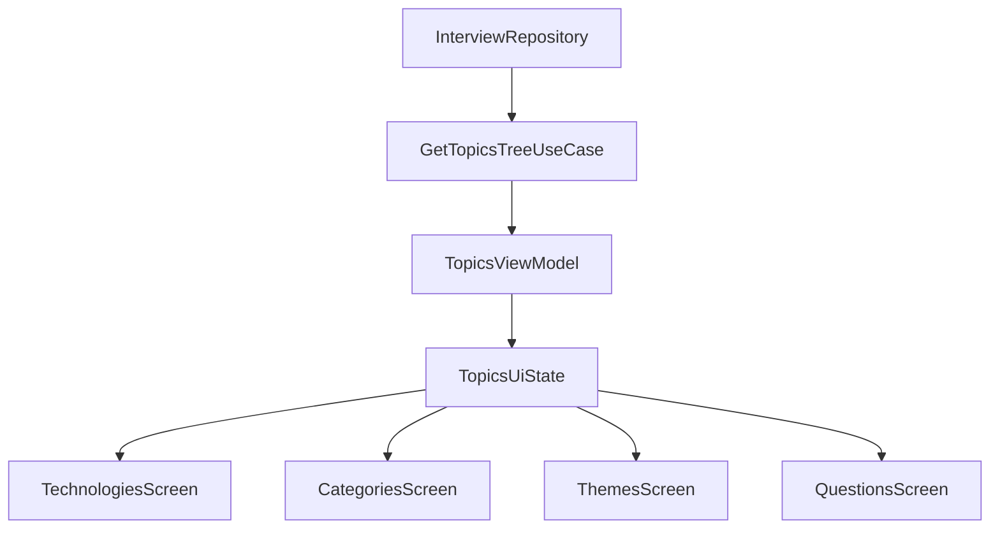

# Экран `Темы`: Clean Architecture + MVVM + UseCase

## Что уже есть

- В навигации есть маршрут вкладки `TopicsRoute` в `[/Users/n.novichkov/AndroidStudioProjects/AchLine/composeApp/src/commonMain/kotlin/ru/towich/achline/navigation/AppRoutes.kt](/Users/n.novichkov/AndroidStudioProjects/AchLine/composeApp/src/commonMain/kotlin/ru/towich/achline/navigation/AppRoutes.kt)`.
- Данные уже содержат поля для группировки (`technologyId`, `categoryId`, `themeId`, `themeTitle`) и прогресс (`shownCount`, `correctCount`) в `[/Users/n.novichkov/AndroidStudioProjects/AchLine/composeApp/src/commonMain/kotlin/ru/towich/achline/domain/Models.kt](/Users/n.novichkov/AndroidStudioProjects/AchLine/composeApp/src/commonMain/kotlin/ru/towich/achline/domain/Models.kt)`.
- Источник данных для экрана можно использовать тот же, что и в категориях: `loadBundleAndOverlay()` + `mergeBundleWithOverlay(...)` из `[/Users/n.novichkov/AndroidStudioProjects/AchLine/composeApp/src/commonMain/kotlin/ru/towich/achline/data/InterviewRepository.kt](/Users/n.novichkov/AndroidStudioProjects/AchLine/composeApp/src/commonMain/kotlin/ru/towich/achline/data/InterviewRepository.kt)` и `[/Users/n.novichkov/AndroidStudioProjects/AchLine/composeApp/src/commonMain/kotlin/ru/towich/achline/domain/Merge.kt](/Users/n.novichkov/AndroidStudioProjects/AchLine/composeApp/src/commonMain/kotlin/ru/towich/achline/domain/Merge.kt)`.

## Архитектурные ограничения

- `presentation` не знает о `data` напрямую, только о use case и domain-контрактах.
- Вся агрегация метрик и сборка иерархии выполняется в `domain` через use case.
- UI экрана `Темы` реализуется в MVVM-стиле: `ViewModel -> UiState`, события UI обрабатываются методами ViewModel.
- Навигация между уровнями (`technology/category/theme/questions`) управляется состоянием ViewModel (текущий уровень + выбранные id), а не ad-hoc mutable state в composable.

## Реализация

1. Выделить доменные сущности и контракты для Topics:
  - `TopicsTree`, `TechnologyNode`, `CategoryNode`, `ThemeNode`, `QuestionNode`.
  - На каждом уровне поля `shownCountTotal`, `correctCountTotal`; у вопроса `shownCount`, `correctCount`.
2. Добавить use case (например `GetTopicsTreeUseCase`) в `domain`:
  - Загружает данные через `InterviewRepository`.
  - Выполняет merge и строит иерархию `Technology -> Category -> Theme -> Question`.
  - Сортирует группы и вопросы для стабильного отображения.
3. Спроектировать MVVM-контракт в `presentation/topics`:
  - `TopicsUiState`: loading/error + текущий уровень и выбранные id.
  - `TopicsUiAction` (или прямые методы ViewModel): загрузка, выбор технологии/категории/темы, back.
  - При необходимости `one-shot` событий (snackbar/навигационный сигнал) — отдельный `SharedFlow` эффектов.
4. Реализовать `TopicsViewModel`, который:
  - Вызывает `GetTopicsTreeUseCase`.
  - Обрабатывает UI-actions/методы и обновляет `TopicsUiState`.
  - Отдаёт в UI только `StateFlow<TopicsUiState>`.
5. Реализовать UI-экраны каскада в `presentation/topics`:
  - Списки технологий, категорий, тем и вопросов.
  - На каждом уровне отображать `Показов` и `Правильных`.
  - На экране вопросов по нажатию на элемент открывать `AlertDialog`/диалог с полным текстом ответа.
  - Стилистику переиспользовать по образцу `InterviewCategoriesScreen`.
6. Интегрировать Topics flow в `App.kt`:
  - Заменить `TopicsPlaceholderScreen` на новый entry composable.
  - Сохранить текущую таб-навигацию приложения.
7. Покрыть тестами:
  - Unit-тесты use case (группировка, суммы метрик, сортировка).
  - Unit-тесты ViewModel (переходы между уровнями и back).
  - Smoke-проверка отсутствия регрессий во вкладках `Категории` и `Собес`.

## Поток данных

## Файлы (целевые)

- Обновить: `[/Users/n.novichkov/AndroidStudioProjects/AchLine/composeApp/src/commonMain/kotlin/ru/towich/achline/App.kt](/Users/n.novichkov/AndroidStudioProjects/AchLine/composeApp/src/commonMain/kotlin/ru/towich/achline/App.kt)`
- Добавить/обновить: `domain/topics/*` (модели, use case, логика агрегации)
- Добавить/обновить: `presentation/topics/*` (MVVM-контракты, ViewModel, composable-экраны)
- Переиспользовать: `[/Users/n.novichkov/AndroidStudioProjects/AchLine/composeApp/src/commonMain/kotlin/ru/towich/achline/domain/repository/InterviewRepository.kt](/Users/n.novichkov/AndroidStudioProjects/AchLine/composeApp/src/commonMain/kotlin/ru/towich/achline/domain/repository/InterviewRepository.kt)`

## Критерии готовности

- Во вкладке `Темы` доступны 4 последовательных экрана: технологии, категории, темы, вопросы.
- На каждом уровне корректно отображаются суммы `Показов` и `Правильных`.
- У каждого вопроса отображаются персональные `Показов` и `Правильных`.
- По нажатию на вопрос открывается диалог с ответом и закрывается явным действием пользователя.
- Back-навигация возвращает пользователя на предыдущий уровень каскада.
- Архитектурно: UI зависит от use case/контрактов, а не от data-реализаций; состояние экрана управляется через MVVM.

